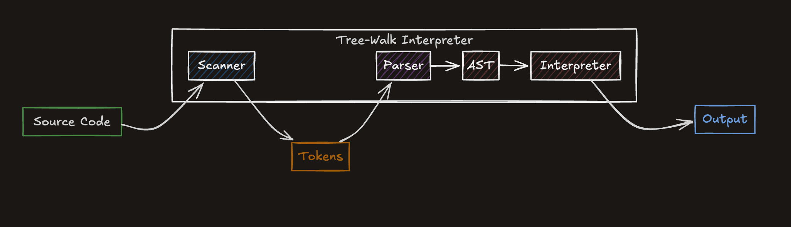

# go-lox

a personal go implementation of the lox interpreter from crafting interpreters by robert nystrom.

  
   
  <em>current progress on what I've learnt so far</em>

built for learning, not for production.

current read: ***chapter 6***

_a peak interest in practicing go whilst revisiting the concepts of compilers and interpreters_

